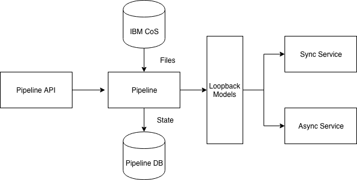

# Watson Services Pipeline

A Pipeline framework based on Node.js and Loopback.  This implementation is based on the Watson Strategic Partnerships Engineering Framework.

# Pipeline High-Level Concepts



The Pipeline Component orchestrates the service interactions and maintain state throughout the pipeline execution.

The Pipeline Component uses out of the box Loopback Model architecture to execute functions on the models.

The Pipeline Component supports out of the box IBM Cloud Object Storage (COS) interactions to retrieve and save large files.

The Pipeline Component provides a REST API Interface for interacting with the instances of the pipeline.

# Pipeline Configuration

The Pipeline is also a Loopback Component.  The Pipeline Component is already defined in the `server/component-config.json` file.

The Pipeline Component is created with a pipeline configuration object.  The basic parameters of the Pipeline Configuration Object is as follows;

## Pipeline Configuration Object

| Field | Description |
|-------|-------------|
| componentStorageModel | A Loopback Model that points to the mass storage container used in the pipeline.  The value specified should be the Model Name. |
| instanceDataSource | The Loopback DataSource for the Cloudant (or other) database that will be used for the Pipeline Execution State |
| pipelines | An array of pipeline definitions (See Below) |

## Pipeline Definition Object

The pipeline definition object tells the pipeline runtime what steps to execute as well as other information to execute the pipeline.  It consist of the following parameters.

| Field | Description |
|-------|-------------|
| name  | The name of the pipeline.  This name must be unique and is used to reference this particular definition. |
| bucket | The COS Bucket this pipeline will used to retrieve and store data in. |
| mapper | The mapper model name.  This is a model that consist of functions to map requests and responses before and after a service call is made. |
| steps  | An array of steps in the pipeline |

## Pipeline Step Object

This is a very simple object that tells the pipeline runtine what method to execute on what service.

| Field | Description |
|-------|-------------|
| description | A description of the step |
| model | The model where the method to execute is defined |
| method | The method that should be executed in the step |
| until | This step will be executed until the function returns true.  The until function must be defined in the mapper service.  Used to process multiple files/objects in a single step |

# Implementing a pipeline

## Loopback Models

Start by creating models in Loopback like you usually would.  These models would mostly act as proxies to Watson services.  You can use the provided Loopback components in the project for the basic functionality.

Follow the example service to implement some of the design patterns like sync, async or array handling in your own services.

Use the Loopback Explorer to test out your models.

## Define the pipeline

Edit the `server/component-config.json` file and add a new pipeline definition to `pipelines` array.  Follow the specs above.

## Setting up IBM Cloud

1. If you do not already have an IBM Cloud account, [sign up here](https://console.ng.bluemix.net/registration).
2. Log into IBM Cloud with your own credentials.
3. Create a new application by clicking on the Create Resource button on the IBM Cloud Dashboard.
4. On the left navigation, select Cloud Foundry Apps.
5. Click on the SDK for Node.js option on the right.
6. Enter your unique application name you though of before and click the Create button.
7. Wait until the application is started and available.
8. From the IBM Cloud Dashboard, select the newly created application.
9. Select Connections on the left.

### Create the following services using the procedure below

>You need some database that is supported by Loopback, doesn't have to be Cloudant

- `Cloudant NoSql Database`

1. Click on the Connect new button.
2. Search for the service you would like to create.
3. Create the service using the free, light or standard plans.
4. Bind it to your application.
5. Re-stage the application.

### Create a database in Cloudant

1. From the IBM Cloud Console, select the Cloudant Service Instance you created for this application.
2. Launch the tooling to open the Cloudant Dashboard.
3. Create a new database called `pipeline-db`.

This database is required to keep the pipeline state in.

### Create and bind Cloud Object Storage

>Only required if you need Cloud Object Storage to process big files like audio or video

CoS is a bit different than other services as it is account wide and part of IAM.  If you don't have an instance of Cloud Object Storage already provisioned, do so now.

Due to the application requiring HMAC credentials, the binding must be done from the command line.

- Make sure you have the bx cli installed.
- Log into your account using bx login, target the org, space and resource group.
- Make sure you belong to the `default` resource group or whatever resource group you have the Cos in.
- Now run the following command

`bx resource service-binding-create [Cloud Object Storage Alias Name] [The application name] Writer -p '{"HMAC": true}'`

## Installing the dependencies

The server dependencies are controlled and defined in [the main package.json](./package.json).

The client dependencies are controlled and defined in [the client package.json](./client/package.json).

To install all required dependencies, execute the following script from the project root.

```
npm install
```

## Building the application

>For the application to run on IBM Cloud or locally, it needs to be build first.  

To do that, the Prerequisites needs to be met and install must have been executed successfully.

From the App folder, run the command `npm run build:client-prod`.

This will build the code into a folder called dist that will contain 1 sub-folders.  If any error occurred, then the build wasn't successful and is probably a dependency issue or install that wasn't ran or successful.

# Running the app on IBM Cloud

> You need to have the bx or ibmcloud CLI installed locally before you can do this step.

1. Push the app to IBM Cloud.

  ```
  $ bx cf push
  ```

2. The application should now be running on IBM Cloud.  You can access the application URL using the application name you defined in the manifest.yml file with a '.mybluemix.net' appended to it.

3. The application is secured with a username and password.  By default the credentials are username = watson and password = p@ssw0rd.

4. To modify the list of users for this application, edit the file `server/boot/init-api-users.js` and modify the array of users.

# Watson Service Configuration

## Configuration files

1. The `vcap-local.json` represents the IBM Cloud VCAP environment locally.  This file is only used when you run the server locally to provide access to the credentials for the services.  An example file is provided called `vcap-local-example.json` which can be renamed to `vcap-local.json`.  Credentials can be copied from the connections page on IBM cloud into this file.

2. The `env-vars.json` file provides a list of environment variables that map either to a VCAP value or a hardcoded value.  An example file is provided called `env-vars-example.json` that can be renamed to `env-vars.json`.

To make the credentials available as an environment variable, you first have to populate the credentials in the `vcap-local.json` file, and then create referenced to the credential values in the `env-vars.json` file.

## Watson services components

This framework contains Loopback components for all Watson services.  To enable a component, you have to edit the `server/component-config.json` file and add the required component to the file.

```
"./components/watson-assistant-component/watson-assistant-loader.js": {}
```


